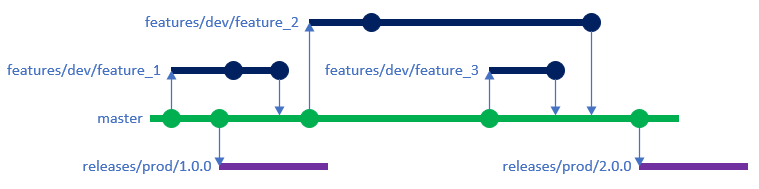
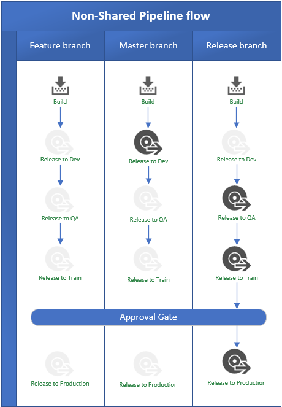

# Azure Devops - YAML pipelines and branching strategies
YAML pipelines are defined in Azure DevOps to build and deploy infrastructure code. A single pipeline may be used in multiple scenarios (e.g. building and releasing code in various environments) to achieve a desired result without having to build and maintain multiple pipelines.

To support the YAML pipelines, a specific branching strategy and naming convention must be followed.

## Branching strategies
A [scaled trunk-based branching strategy](https://trunkbaseddevelopment.com/) with Release Flow is used to manage the code, reduce merge conflicts, and support the CI/CD pipelines. From a high-level, the branching strategy is shown in the diagram below.

- Changes performed in feature branches contain the following actions:
  - [TFLint](https://github.com/terraform-linters/tflint) - a pluggable Terraform Linter for static code analysis
  - [TFSec](https://github.com/tfsec/tfsec) - Security scanner for Terraform code
  - [Terratest](https://github.com/gruntwork-io/terratest) - automated test framework for Terraform code
  - [Terraform plan](https://www.terraform.io/docs/cli/commands/plan.html) - validates the Terraform code and creates an execution plan
- Single collaboration branch, master, which requires a pull request and contains the following actions:
  - [Terraform format](https://www.terraform.io/docs/cli/commands/fmt.html) - rewrites Terraform configuration files to a canonical format and style
- Release branches created to deliver the code to deployment targets

Following this branching strategy, the pipeline can then be "branching strategy aware" and trigger the correct action based on the branch.

