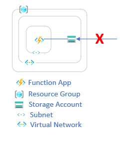

# Overview

This example shows how to provision an Azure Function App with an associated storage account where the Function App is integrated into a virtual network and traffic to the storage account is only allowed from that virtual network. This configuration essentially makes the storage account "private" to the virtual network and only accessible to resources within it. In this case, the Function App has access so the storage account is private to the Function App.

## Architecture

This digram indicates what the architecture of the example looks like.

As the diagram shows, access to the storage account from outside the virtual network is blocked.
