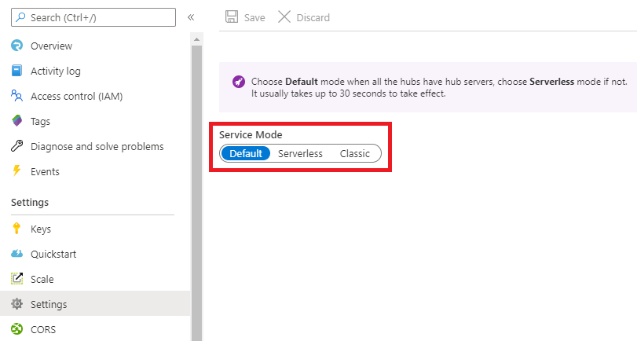

# Overview

This example includes resources necessary to implemment a serverless SignalR implementation.

## What is "serverless SignalR"?

This discussion will not go into deep detail about what Azure SignalR service is or its different modes. There are lots of documentats provided by Microsoft that already have these details:

[What is Azure SignalR Service](https://learn.microsoft.com/en-us/azure/azure-signalr/signalr-overview)

[Service mode in Azure SignalR Service](https://learn.microsoft.com/en-us/azure/azure-signalr/concept-service-mode#default-mode)

But, this discussion will present a very high-level review of SignalR to give context around what this example is for.

Let's start with what SignalR has always been, in the traditional sense. To implement SignalR you would build a server application, usually as an ASP.NET application hosted in IIS but could also be a simple console application or Windows service. The server application would implement one, or more, hubs that clients would use to communicate along with other features such as managing client connections and communications.

Moving forward to Azure, the SignalR Service lifts the management of clients and communication away from you leaving you the only task of implementing the hub(s) that are specific to your business process. Hub(s) are still developed and hosted within an [ASP.NET Core SignalR](https://learn.microsoft.com/en-us/aspnet/core/signalr/introduction?view=aspnetcore-7.0), but clients no longer connect directly to the hub server. Client and hub server now connect to SignalR Service and use the service as a proxy leaving all the client management and communication details to the SignalR Service. The following diagram shows the [typical application structure](https://learn.microsoft.com/en-us/azure/azure-signalr/concept-service-mode#default-mode).

With this structure, you develop the Hub Server and host it in an Azure App Service. This is known as `Default mode` for the SignalR Service and is the most common mode.

But, what if you want to write your hub server using an Azure Function instead of a full-blown ASP.NET Core SignalR application. This is what the Serverless mode is for.

## Azure resources provisioned by this example

The essential resources to make this serverless SignalR work are the Azure SignalR service and the Azure Function. There are several other Azure resources that are also provisioned by this example that are required for an Azure Function implementation with full telemetry (i.e. logging).

- Azure SignalR Service: configured in Serverless mode
- Azure Function: includes the following resources, as well as the Function itself
    - App Service Plan: hosts the Azure Function
    - Storage Account: holds the Azure Function code
    - Application Insights: provides logging and telemetry for the Azure Function
        - Log Analytics Workspace: provides a sink for logging and Application Insights telemetry

With all of these resources, you now have a fully functional serverless SignalR environment that supports logging and telemetry.

## But wait, the example title says "...with-rest"

SignalR is usually used for client-to-client communication. Meaning multiple clients connected to the SignalR service can communication with each other. But what if you want server-to-client communication. [This can be achieved by either of two methods](https://learn.microsoft.com/en-us/azure/azure-signalr/concept-service-mode#serverless-mode):

- Use [REST APIs](https://learn.microsoft.com/en-us/azure/azure-signalr/signalr-reference-data-plane-rest-api) for a one-time send event, or
- Use a WebSocket connection so that you can send multiple messages more efficiently. This WebSocket connection is different than a server connection.

This example uses the REST APIs method, hence the title.

